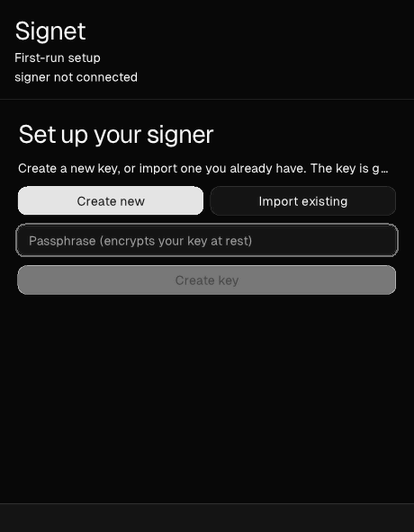

# Signet

**A native remote signer for [Nostr](https://nostr.com).** Signet keeps your
Nostr secret key on a machine you control and signs for your apps over
[NIP-46](https://github.com/nostr-protocol/nips/blob/master/46.md) — the key
never leaves the signer, and every request waits for your explicit approval.

Built on [`zig-nostr/nostr`](https://github.com/zig-nostr/nostr).

> **Status: early / work in progress.** The signer works end-to-end over public
> relays, including those that require NIP-42 authentication. Downloads are
> ad-hoc signed (not notarized) — see [Download](#download).



<sub>First-run key setup (create a new key, or import an existing `nsec`), then
approving a live NIP-46 signing request from a connected client. The key is
generated and held by the signer daemon — it never enters the GUI.</sub>

## Download

Grab the latest **`Signet-<version>-macos.zip`** from the
[**releases page**](https://github.com/zig-nostr/signet/releases/latest), unzip
it, and move `Signet.app` to `/Applications`.

Signet is **ad-hoc signed, not notarized** — on purpose. It holds your keys, so
the trust anchor is a build you can read and reproduce, not an Apple signature:
every release is built by CI from a tagged commit
([`.github/workflows/release.yml`](.github/workflows/release.yml)), and you can
reproduce it yourself with the [Build](#build) steps below. (Notarizing would
mean routing each build through an Apple Developer account, which buys a WIP
key-holder little over a build you verified yourself.)

Because it isn't notarized, macOS quarantines the download and Gatekeeper blocks
the first launch. Clear the quarantine flag once — this is the reliable step:

```sh
xattr -dr com.apple.quarantine /Applications/Signet.app
open /Applications/Signet.app
```

That only strips the "downloaded from the internet" marker; the app stays ad-hoc
signed. (Finder's right-click → **Open**, or **System Settings → Privacy &
Security → Open Anyway**, works on some setups too — but on recent macOS an
ad-hoc app is often flagged *"is damaged"*, where only the command above clears
it.)

Prefer to trust nothing you didn't build? Skip the download and
[build from source](#build).

## Two components, one product

Signet is split into two processes on purpose, so the secret key stays isolated
from the user interface:

- **[`daemon/`](daemon)** — the headless NIP-46 signer ("bunker"). It holds the
  encrypted key, connects to your relays, and in GUI mode serves a
  **loopback-only** approval API. It runs standalone as a CLI for advanced users,
  or supervised by the GUI.
- **[`gui/`](gui)** — the native desktop approver, built with the
  [Native SDK](https://github.com/vercel-labs/native) (declarative markup plus
  Zig, rendered natively — no WebView, no Electron). It shows each pending
  request and sends back your approve/deny decision. The key never enters it.

Packaged together, one download brings up both as a single macOS `.app`.

## Build

Each component builds independently — see its own README for details:

```sh
# daemon (Zig 0.16)
cd daemon && zig build -Doptimize=ReleaseFast

# gui (Native SDK CLI: npm install -g @native-sdk/cli)
cd gui && native build
```

- [`daemon/README.md`](daemon/README.md) — running the signer, key management,
  relays, and the approval API.
- [`gui/README.md`](gui/README.md) — the approval app and how it connects to (or
  supervises) the daemon.

## License

MIT © Sepehr Safari
